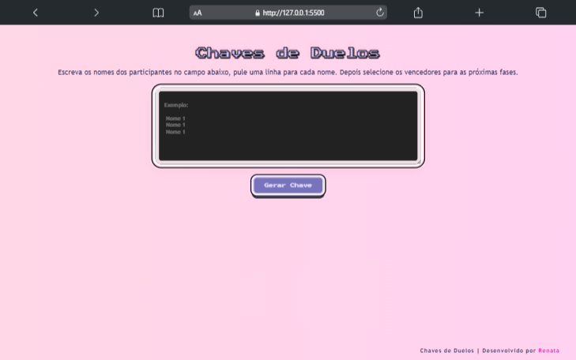

<!-- Logo or Banner -->
<!-- Seu projeto pode ter Logo, Nome ou Logo e Banner. -->
<h1 align="center" id="project_name">
   
  <!-- Link externo ou local(.github). -->
  
   
Chave de Duelos   
</h1>

 Fazer chaveamentos de maneira simples e direta. 

  
 <a href="https://renataalvescunh.github.io/chave-de-duelos/" a/> ⭐ Clique aqui para acessar o site ⭐</a> 

<h2 id="about">
💻 Sobre o projeto
</h2>

 O Chave de Duelos é uma aplicação web que facilita a criação de chaves de torneios de forma rápida e simples. Com uma interface intuitiva: permite que o usuário adicione os nomes dos participantes do confronto; crie o chaveamento de de forma aleatória; visualize o andamento das partidas e obtenham os resultados facilmente. 

<h2 id="layout">🎨 Layout</h2>

  

<h2 id="layout"> 🔨 Tecnologias usadas: </h2>

<ul>
    <li>HTML5</li>
    <li>CSS3</li>
    <li>JavaScript </li>
</ul>

---

Feito com 💌. 
"